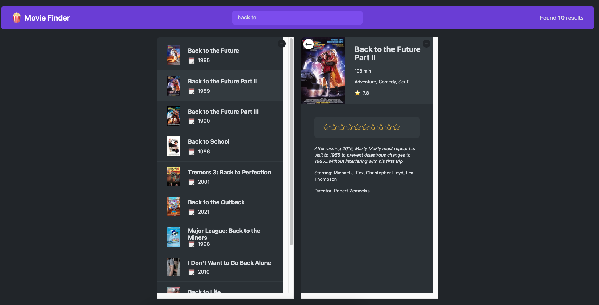

# Movie Explorer

Movie Explorer is a React-based web application that allows users to search for movies, retrieve detailed information about them using the OMDb API, and create a personalized list of favorite movies.



## Features

- **Search Movies:** Users can search for movies by title, and the application will fetch relevant details from the OMDb API.

- **View Movie Details:** Detailed information about each movie, including title, release year, genre, plot, and more, is displayed.

- **Add to Favorites:** Users can add movies to their favorites list for quick access to their preferred films.

- **Display Favorites List:** A dedicated section to view and manage the user's list of favorite movies.

## Technologies Used

- React: A JavaScript library for building user interfaces.
- OMDb API: An API to retrieve movie-related information.

## Getting Started

### Prerequisites

- Node.js and npm installed on your machine.

### Installation

1. Clone the repository:

   ```bash
   git clone https://github.com/your-username/movie-explorer.git
   ```

2. Change directory:

   ```bash
   cd movie-explorer
   ```

3. install dependencies:

   ```bash
   npm install
   ```

4. Start the application:

   ```bash
   npm start
   ```

## Usage

1. Enter a movie title in the search bar.
2. Click on a movie card to view detailed information.
3. Add a movie to your favorites list by clicking the "+" button.

